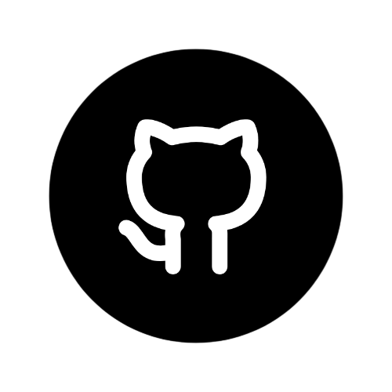

<p align="right">
  <a href="https://visitorbadge.io/status?path=https%3A%2F%2Fgithub.com%2FLuckyluka17"></a>
</p>

<p align="center">

<br><br>
<a href="https://discord.com/users/428193377863991296" target="_blank">

</a>
<a href="https://github.com/Luckyluka17" target="_blank">

</a>
<a href="mailto:luckyluka17@hestiaprojects.fr" target="_blank">

</a>
</p>

```html
<h1>Luckyluka17</h1>
<p>Salut, et bienvenue sur ma page Github !</p>
```

## Ce que j'utilise 
### ⌨️ Éditeur de code
- [Visual Studio Code](https://code.visualstudio.com/)
- Thème sombre +
- [VSCode icons](https://marketplace.visualstudio.com/items?itemName=vscode-icons-team.vscode-icons)
### 🖥️ Terminal
- [Windows Terminal]()
- Powershell
### 🎒 Productivité
- [Windows PowerToys](https://apps.microsoft.com/store/detail/microsoft-powertoys/XP89DCGQ3K6VLD?hl=fr-in&gl=in)
- [Gitbook](https://www.gitbook.com/)
- [Spotify](https://www.spotify.com/fr/)
### 🛠️ Outils
- [Brave](https://brave.com/fr/)
- [Thunderbird](https://www.thunderbird.net/fr/)
- [KeepassXC](https://keepassxc.org/)
- [Photofiltre](http://www.photofiltre.com/)
### 🧪 Langages de programmation
- Python
- HTML
- CSS
- Batch
- PHP (en cours d'apprentissage)
- Ti-basic

---

<details>
  <summary>Mes statistiques Github</summary>
    <p></p>
</details>
<details>
  <summary>Langages les plus utilisés</summary>
    <p></p>
</details>

